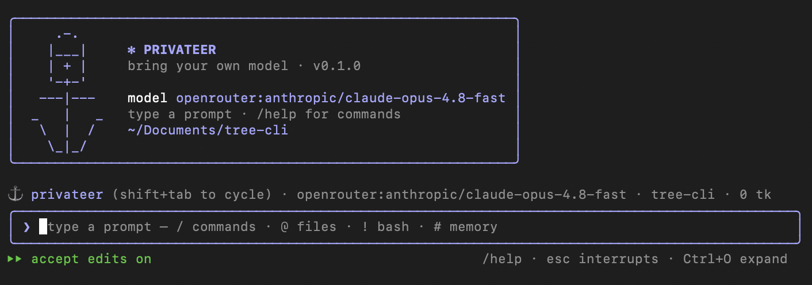

<p align="center">
  
</p>

<h1 align="center">⚓ Privateer</h1>

<p align="center">
  <strong>A provider-agnostic terminal coding agent — bring your own model.</strong>
</p>

<p align="center">
  <a href="https://github.com/privateer-agent/privateer-agent/actions/workflows/ci.yml">
    
  </a>
  = 20" />
  
  
  
</p>

Switch between **OpenRouter**, **Anthropic**, **OpenAI**, local **Ollama**, and **NEAR AI**
(private, attestable inference) with one command. Built on the Vercel AI SDK, so tool-calling
and streaming work identically across every provider — no model lock-in, no separate code paths.

<p align="center">
  
</p>

## Why Privateer?

- **No lock-in.** Point it at a frontier model today and a local Ollama model tomorrow —
  `/model` swaps mid-session. Your config, commands, and agents come along for the ride.
- **The agent UX you already know.** Plan mode, checkpoint/rewind, a modal prompt, slash
  commands, sub-agents, and project memory — but vendor-neutral.
- **Genuinely extensible.** MCP servers, lifecycle hooks, custom commands, output styles,
  and sub-agents are all just files under `.privateer/`. No plugins to compile.
- **Zero binary deps.** The file/search/shell tools are pure Node — nothing to install
  beyond `node`.

## Highlights

- A modal prompt with `/` command and `@` file autocomplete, `!` shell passthrough,
  `#` memory append, input history, optional **vim** mode, and **ctrl-r** history search
- Layered `settings.json` (user → project → local → managed), **custom slash commands**
  and **output styles** as markdown files
- **Plan mode** (read-only → present a plan → approve), **checkpoint/rewind** of
  conversation and files
- Extensible: **MCP servers** (local stdio + remote HTTP/SSE, with interactive OAuth),
  lifecycle **hooks**, and **custom sub-agents**
- Background shells, bounded parallel sub-agents, thinking display, structured compaction,
  and image attachment for vision-capable models
- **Zero-Data-Retention surfacing** for OpenRouter: a status-bar shield colors the selected
  model's retention posture, and `/zdr` pins routing to zero-retention endpoints
- **Private, verifiable inference** via NEAR AI: every model runs in a TEE, a `⛉ TEE` status
  shield reflects the live attestation, and `/verify` fetches the cryptographic proof

## Quickstart

```bash
git clone https://github.com/privateer-agent/privateer-agent.git
cd privateer-agent
npm install
export OPENROUTER_API_KEY=sk-or-...     # one provider is enough
npm start                               # launches the interactive TUI
```

First run walks you through picking a provider and default model. From there, just type.

## Contents

- [Requirements](#requirements) · [Install](#install) · [Configure a provider](#configure-a-provider) · [Model routing](#model-routing) · [Data retention (ZDR)](#data-retention-zdr) · [Private inference (NEAR AI)](#private-inference-near-ai) · [Usage](#usage)
- [The prompt](#the-prompt) · [Slash commands](#slash-commands) · [Tools](#tools)
- [Customize & extend](#customize--extend) · [Permission modes](#permission-modes) · [Project context](#project-context)
- [Develop](#develop) · [Caveats](#caveats) · [Docs](#docs) · [License](#license)

## Requirements

- Node.js ≥ 20
- An API key for at least one provider (or a local Ollama install)

## Install

```bash
npm install        # install dependencies
npm link           # optional: put `privateer` on your PATH
```

Or run directly without linking:

```bash
npm start          # launches the interactive TUI
# or
node bin/privateer.mjs
```

## Configure a provider

Privateer reads credentials from environment variables or a config file.

**Env vars (quickest):**

```bash
export OPENROUTER_API_KEY=sk-or-...      # gateway to ~everything
export ANTHROPIC_API_KEY=sk-ant-...
export OPENAI_API_KEY=sk-...
export OLLAMA_BASE_URL=http://localhost:11434/api   # optional; defaults to this
export NEAR_AI_API_KEY=...               # private TEE inference (cloud.near.ai)
```

**Config file** — `~/.privateer/config.json` (global) and/or `./.privateer/config.json` (per project):

```json
{
  "defaultModel": "openrouter:anthropic/claude-opus-4.8",
  "permissionMode": "default",
  "providers": {
    "openrouter": { "apiKey": "sk-or-..." },
    "anthropic":  { "apiKey": "sk-ant-..." }
  }
}
```

Override the config location with `PRIVATEER_HOME`.

## Model routing

`defaultModel` handles most turns, but it's often the wrong tool for a particular one —
it may not accept the file you dropped in, or you'd rather spend a cheaper model on a
trivial question. The optional **`router`** block lets Privateer switch models per turn
based on the turn's **data type** and shape:

```json
{
  "defaultModel": "openrouter:minimax/minimax-m3",
  "router": {
    "vision":   "openrouter:google/gemini-2.5-flash",
    "document": "openrouter:anthropic/claude-opus-4.8",
    "audio":    "openrouter:google/gemini-2.5-flash",
    "video":    "openrouter:google/gemini-2.5-flash",
    "long":     "openrouter:anthropic/claude-opus-4.8",
    "fast":     "openrouter:openai/gpt-4o-mini",
    "longThreshold": 60000,
    "fastMaxChars": 280,
    "inlineTextMaxBytes": 65536,
    "auto": true
  }
}
```

Reference a file in the prompt — drag-drop, paste a path, or `@`-mention — and Privateer
classifies it by **modality** and routes accordingly:

| Route | Chosen when the turn (or conversation) includes… |
|---|---|
| **vision** | an image (`.png .jpg .jpeg .gif .webp`) |
| **document** | a PDF (`.pdf`) |
| **audio** | audio (`.mp3 .wav .m4a .ogg .flac`) |
| **video** | video (`.mp4 .mov .webm .mkv`) |
| **long** | the estimated context exceeds `longThreshold` tokens (default: half of `contextBudget`) |
| **fast** | the prompt is ≤ `fastMaxChars` characters (and needs no attachment) |
| **default** | everything else (`defaultModel`) |

Each attached file collapses to a chip — `[Image #1]`, `[PDF #2]`, `[Audio #3]`,
`[Video #4]` — while the file itself rides along to the model. **Code/CSV/markdown and
other text files aren't routed**: they're read and inlined into the prompt (up to
`inlineTextMaxBytes`; larger ones are left as a path for the agent's read tool).

**Capability requirements outrank `long`/`fast`.** A turn that needs a modality is
routed to a model that can actually accept it — and routing is **sticky**: once a file
is in the conversation, later turns stay on a capable model so the attachment is never
replayed to one that can't read it. A turn that needs **several** modalities at once
(say an image *and* a PDF) is routed to a model whose support covers all of them. When
a turn is routed, the transcript shows a line like `↪ routed to gemini-2.5-flash ·
image input`.

**Hybrid auto-detect** (`"auto": true`, the default): if you reference, say, a PDF but
haven't set `router.document`, and your `defaultModel` can't read PDFs, Privateer
auto-selects a capable model from a configured provider. Set the route explicitly to
control exactly which model is used, or `"auto": false` to disable it (you'll get a
one-line warning when nothing can handle the modality).

## Data retention (ZDR)

When you route through **OpenRouter**, where your prompts end up depends on which upstream
endpoint serves the request — some retain data, some don't. Privateer surfaces that for the
**selected model** so you can see the posture before you send, and optionally enforce it.

**The status-bar shield.** A `⛉ ZDR` badge sits in the status line, colored against the
model you have selected:

| Badge | Meaning |
|---|---|
| 🟢 `⛉ ZDR` | The model has a zero-retention endpoint **and** enforcement is on — the request is pinned to it, so prompts can't be retained. |
| 🟡 `⛉ ZDR` | A zero-retention endpoint exists, but enforcement is off — a request *may* still land on an endpoint that retains prompts. |
| 🔴 `⛉ ZDR` | No zero-retention endpoint for this model, or it's blocked by your account's privacy settings — under enforcement the request is rejected outright. |
| `⛉ ZDR?` (dim) | Posture unknown — no OpenRouter key yet, still loading, or the lookup failed. |

The badge only appears for OpenRouter models; other providers show nothing. The posture is
derived from two authenticated OpenRouter endpoints — `/endpoints/zdr` (models with at least
one zero-retention endpoint) and `/models/user` (models your account's privacy settings
actually permit) — fetched once per account and re-evaluated synchronously as you switch
models. The same colors annotate every row in the `/model` picker, with a legend explaining
them.

**Enforcement.** Run **`/zdr`** to toggle enforcement (persisted as
`providers.openrouter.enforceZdr`). With it on, Privateer pins routing to zero-retention
endpoints (`provider.zdr` on every request), so yellow models go green — and any model
*without* a zero-retention endpoint is rejected rather than silently retained. Toggle it off
to let OpenRouter route freely. Enforcement applies to OpenRouter only; add an OpenRouter key
with `/login` first.

## Private inference (NEAR AI)

**NEAR AI Cloud** runs every model inside a **Trusted Execution Environment** — an Intel TDX
confidential VM paired with an NVIDIA confidential-computing GPU. Your prompts are encrypted
all the way into the enclave (TLS terminates *inside* the TEE, not at a load balancer), so
the model's inputs, weights, and outputs are invisible to the infrastructure provider, the
model provider, and NEAR itself. And it's not "trust us": each request can produce a
**cryptographic attestation** proving the inference happened on genuine TEE hardware, signed
by a key that never leaves the enclave and bound to a nonce you supply.

It's a drop-in OpenAI-compatible provider — pick a `nearai:*` model with `/model` (e.g.
`nearai:zai-org/GLM-5.1-FP8`) and everything else works as usual.

**The status-bar shield.** A `⛉ TEE` badge appears whenever a NEAR AI model is selected,
colored by the live attestation for that model:

| Badge | Meaning |
|---|---|
| 🟢 `⛉ TEE` | A fresh attestation came back bound to our nonce, with a TEE signing key and NVIDIA + Intel hardware evidence — confidential **and** verifiable. |
| 🟡 `⛉ TEE` | A report returned but couldn't be fully confirmed here (missing signing key, hardware marker, or nonce echo). |
| 🔴 `⛉ TEE` | No attestation material returned. |
| `⛉ TEE?` (dim) | Unknown — no NEAR AI key yet, still loading, or the lookup failed. |

**`/verify`.** Run it on a NEAR AI model to fetch the attestation on demand and print the
verdict, detected hardware, the enclave's signing address, and the nonce. Privateer does a
pragmatic freshness + presence check suited to a terminal; for full validation of the raw
NVIDIA/Intel quote chains, take the printed report to the
[NEAR AI Cloud Verifier](https://github.com/nearai/cloud-verifier).

## Usage

```bash
privateer                                   # interactive TUI with the default model
privateer -m openrouter:anthropic/claude-opus-4.8
privateer -c                                # resume the last session in this dir
privateer -p "summarize src/"               # headless one-shot, prints to stdout
```

Run `/model` (no argument) to browse the models each configured provider actually
offers — the list is fetched live using the API key you entered, then filtered as you
type. Onboarding ends on the same picker so you choose your default model up front.

You can also pass a model string directly as `provider:model`:

| Example | |
|---|---|
| `openrouter:anthropic/claude-opus-4.8` | any model on OpenRouter |
| `anthropic:claude-opus-4-8` | direct Anthropic |
| `openai:gpt-5.5` | direct OpenAI |
| `ollama:qwen3-coder` | local model |

## The prompt

The input is modal — the first character chooses what happens:

| Prefix | Mode |
|---|---|
| _(text)_ | a normal prompt to the model |
| `/` | a slash command — opens an autocomplete menu |
| `@` | a file mention — fuzzy-completes paths from the cwd |
| `!` | run a shell command locally and show its output (no model turn) |
| `#` | append the rest of the line to `PRIVATEER.md` |

Also: **↑/↓** history, **ctrl-r** reverse history search, emacs line editing
(`ctrl-a/e/u/w`), `ctrl-l` to clear the screen, and **`\`+Enter** for a newline. Messages
typed while the agent is busy are queued and run in order. `/vim` toggles modal (vim)
editing. Reference an image file to attach it for vision-capable models — by `@`-mention
(`@screenshot.png`), or by pasting a path anywhere in the prompt. Absolute paths and paths
with spaces work too, quoted (`"/Users/me/My Shot.png"`) or backslash-escaped
(`/Users/me/My\ Shot.png`); a leading `/path/...` is treated as a file, not a command. Each
referenced image collapses to a short `[Image #1]` chip in the transcript (numbered across
the session) while the picture itself rides along to the model.

While the agent is working, press **Esc** to interrupt the turn (partial output is kept);
**Ctrl-C** quits.

## Slash commands

Built-ins (plus any custom commands you add):

| Command | |
|---|---|
| `/help` `/doctor` `/config` | help, diagnostics, resolved settings layers |
| `/model [spec]` `/provider` `/login` | choose a model, list providers, re-run onboarding |
| `/permissions [mode]` `/cost` `/context` | permission mode, token usage, context window |
| `/init` `/memory` | write/show `PRIVATEER.md` |
| `/agents` `/mcp [logout]` `/hooks` | inspect sub-agents; MCP status / clear OAuth; hooks |
| `/output-style [name]` `/vim` `/verbose` | persona, modal editing, full tool output |
| `/zdr` | toggle OpenRouter zero-data-retention enforcement (see [Data retention](#data-retention-zdr)) |
| `/verify` | fetch the NEAR AI TEE attestation for the current model (see [Private inference](#private-inference-near-ai)) |
| `/rewind` `/compact` `/clear` `/export` | restore a checkpoint, compact, clear, save transcript |
| `/exit` | quit |

- `/model` — open a picker of each provider's live models (or `/model provider:id` to set one directly).
- `/init` — the agent explores the repo and writes a `PRIVATEER.md` for you
  (`/init --stub` just drops an empty template, no model call).
- `/rewind` — pick an earlier checkpoint and restore the conversation, the files, or both.
- `/compact` — summarize older history to reclaim context (also happens automatically).

## Tools

`read` · `write` · `edit` · `glob` · `grep` · `bash` · `bash_output` · `kill_shell` ·
`todo` · `task` · `web_fetch` · `web_search` — plus any tools exposed by connected MCP servers.

The file/search/shell tools are pure-Node (no external binaries required). Mutating tools
(write/edit/bash) and network tools (web_fetch/web_search, MCP) go through the permission gate.
`todo` maintains the live task list; `task` delegates an investigation to a sub-agent that
returns a summary. `bash` can run detached with `run_in_background`; `bash_output` polls a
background shell's new output and `kill_shell` stops it.

## Customize & extend

Everything below is optional and lives under `.privateer/` (project) or `~/.privateer/`
(user); project files win. Settings merge across `config.json` → `settings.json` →
`settings.local.json` (run `/config` to see the resolved chain).

- **Custom commands** — `.privateer/commands/<name>.md`. The body is a prompt template
  (`$ARGUMENTS`, `$1`…`$9`); optional frontmatter sets `description`/`argument-hint`. They
  appear in `/help` and `/` autocomplete; subfolders namespace as `dir:name`.
- **Output styles** — `.privateer/output-styles/<name>.md` swap the agent's persona.
  Switch with `/output-style <name>` (or `default`).
- **Sub-agents** — `.privateer/agents/<name>.md` with frontmatter (`description`, `tools`,
  `model`). Invoke via the `task` tool's `subagent_type`; `/agents` lists them.
- **Hooks** — a `hooks` section in `settings.json` runs shell commands on `PreToolUse`,
  `PostToolUse`, `UserPromptSubmit`, and `Stop`. A hook blocks by exiting `2` or printing
  `{"decision":"block"}`; `UserPromptSubmit` can inject `additionalContext`. `/hooks` lists them.
- **MCP servers** — declare them in `.privateer/mcp.json` (`{ "mcpServers": { … } }`).
  Both **local stdio** servers (`{ "command", "args", "env" }`) and **remote HTTP** servers
  (`{ "url", "headers?", "transport?" }`) are supported; remote defaults to Streamable HTTP
  with a fallback to legacy SSE. Their tools are namespaced `server__tool` and gated like the
  rest. Remote servers authenticate by a static `headers` bearer token, or — when none is set —
  via **interactive OAuth** (PKCE + dynamic client registration): on a `401` Privateer opens your
  browser, catches the redirect on a loopback port, and caches the tokens (owner-only) under
  `~/.privateer/mcp-auth/`. `/mcp` shows each server's connection and auth state;
  `/mcp logout [server]` clears saved OAuth.

  ```json
  {
    "mcpServers": {
      "fs":     { "command": "npx", "args": ["-y", "@modelcontextprotocol/server-filesystem", "."] },
      "github": { "url": "https://api.githubcopilot.com/mcp/" },
      "internal": { "url": "https://mcp.example.com/mcp", "headers": { "Authorization": "Bearer $TOKEN" } }
    }
  }
  ```
- **Status line** — set `statusLine` to a shell command; it receives session JSON on stdin
  and its stdout becomes the status line.

## Permission modes

| Mode | Behavior |
|---|---|
| `default` | prompt before edits and shell commands |
| `acceptEdits` | auto-approve file edits; still prompt for other shell commands (the default) |
| `bypass` | no prompts (also `--dangerously-skip-permissions` or `--no-quarter`) |
| `plan` | read-only; the agent presents a plan, then you approve to leave plan mode |

At an approval prompt: **y** allow once · **a** always · **n** deny. In plan mode, after the
agent presents its plan: **a** approve and exit plan mode · **k** keep planning.

## Project context

Create a `PRIVATEER.md` in your repo (via `/init`) to give the agent standing
context — conventions, architecture notes, anything it should always know.

## Develop

```bash
npm run typecheck
npm test
```

## Caveats

Privateer's agent core is built provider-agnostic from the ground up; a few areas are
deliberately simplified for now:

- **Prompt caching and extended thinking are Anthropic-only.** Ephemeral cache breakpoints
  and the `thinkingBudget` setting apply to direct Anthropic models and OpenRouter routes to
  `anthropic/*`. Other providers ignore them (a harmless no-op).
- **Checkpoints are in-memory.** `/rewind` is a within-session undo; snapshots live in memory
  and aren't persisted across restarts.
- **Remote MCP OAuth uses a fixed loopback port** (`7777` by default; override with
  `PRIVATEER_OAUTH_PORT`) so the redirect URI stays stable across runs. Set `PRIVATEER_NO_BROWSER=1`
  in headless environments to skip the auto-launch and use the printed URL.
- **Image attachment assumes vision support.** Referenced images are sent as content parts;
  non-vision models will return an error.
- **Compaction estimates context size** (~4 chars/token). The summary itself is
  schema-guided (goals / decisions / files / open threads), with a plain-text fallback, and
  the most recent messages are always kept verbatim.
- **`web_search` scrapes DuckDuckGo's keyless HTML endpoint.** It needs no API key but is
  best-effort and can break if their markup changes. `web_fetch` is robust for known URLs.
- **Protected files** (`.env`, `.npmrc`, shell rc files, …) always prompt before edit — except
  in `bypass` mode, which by definition skips all prompts.

## Docs

- [Architecture](docs/ARCHITECTURE.md) — how the provider layer, agent loop, tools, and permissions fit together
- [Brand assets](brand/README.md) — the logo and icon set

## License

[MIT](LICENSE) © Patrick
